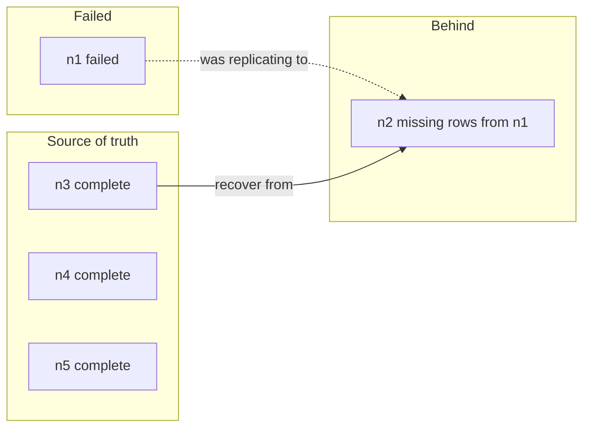
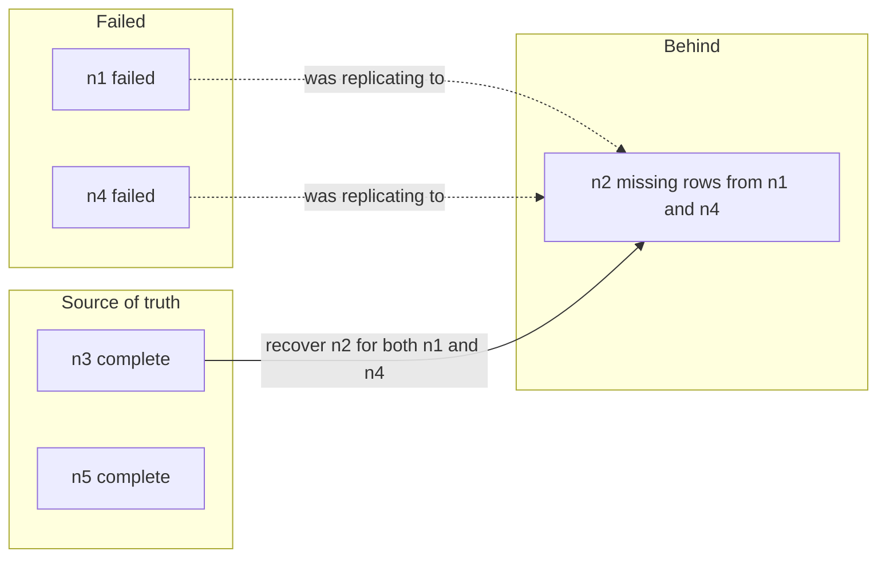
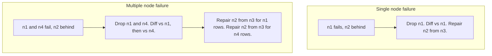
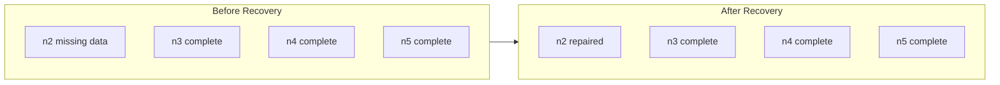

# Recovering from Catastrophic Node Failure

Suppose your cluster is running smoothly with five nodes — n1, n2, n3, n4,
and n5 — all connected using Spock logical replication. Node n1 sends
transactions to the other four nodes. Then something goes wrong: perhaps
because of network delay, n2 has not yet received all of the transactions
that n3, n4, and n5 have already applied. Before n2 can catch up, n1
crashes. You are left with n2 behind the others and no way for it to get the
missing data from n1. This is a **catastrophic node failure** scenario.

Depending on how you run your cluster, more than one node may accept
writes. Later in this document, we also show a multiple-node failure
example where a second node (n4) had also originated transactions before it
failed.

In the following sections, we'll walk through how to recover a cluster using
Spock for replication with the
[Active Consistency Engine (ACE)](https://github.com/pgEdge/ace). You'll
use a fully synchronized node (for example, n3) as the source of truth. ACE
repairs the missing data and can preserve the origin ID and commit
timestamp for each repaired row so that replication metadata stays
correct and your cluster remains consistent and conflict-free.

This document covers two cases:

- **single node failure** (one node fails and another is lagging) 
- **multiple node failure** (two or more nodes fail and one or more survivors
  are behind). 

The same idea applies in both cases; you identify what is missing on the
lagging node(s), then repair using a node that has the complete data, 
preserving the origin ID and timestamp for every repaired row.


## Single Node Failure vs. Multiple Node Failure

The following diagrams show the two scenarios and what to do in each case.

### Scenario 1: Single Node Failure (e.g. n1 fails)

One node (n1) fails; another node (n2) is behind because it did not receive 
all of that node's transactions. The other survivors (n3, n4, n5) have 
complete data.



**Handling this Failure**

* The failed node is: n1
* The corrupted node is: n2

Our source of truth has to be: n3, n4, or n5

Our first step is to clean up: 

  Drop the subscriptions to n1 before dropping node n1 from the cluster.

Then, on each survivor, and for each table, run: 

  `table-diff --preserve-origin n1 --until <n1_failure_time>`

Then, on each survivor, for each table with differences, run `table-repair`
with `--recovery-mode`, `--source-of-truth n3`, and `--preserve-origin`.

These steps will ensure n2 contains all of the rows that originated on n1.

### Scenario 2: Multiple Node Failure

In our next example, we'll assume we have a multi-node failure involving nodes
n1 and n4. If two (or more) nodes fail, leaving one or more survivors, the 
damaged survivors (we'll use node n2) may be missing rows that originated
from **each** failed node. To recover, pick one fully synchronized survivor as
*the* source of truth (we'll use n3) and recover n2, adding data from **both**
n1 and n4.

In this example, we'll assume n4 was also accepting writes before it failed,
so some rows in the cluster have an origin ID of n4.



**Handling this Failure**

* The failed nodes are: n1 and n4
* The corrupted node is: n2

Our source of truth has to be: n3 or n5

Our first step is to clean up: 

  Drop the subscriptions to n1 and n4 before dropping the nodes from the 
  cluster.

Then, on each surviving node, and for each table, run the table-diff command
against each failed node:

  `table-diff --preserve-origin n1 --until <n1_failure_time>`
  `table-diff --preserve-origin n4 --until <n4_failure_time>`

  Each run will return one diff file per table/origin combination.

Then, on each survivor, for each table with differences, run `table-repair`
with `--recovery-mode`, `--source-of-truth n3`, and `--preserve-origin`.

These steps will ensure n2 contains all of the rows that originated on n1 and
n4, with the origin ID and timestamp preserved for each.

!!! note

    In the multiple-node case, you run diff and repair once per failed
    origin. For each table, that means one diff (and one repair) for n1
    and one diff (and one repair) for n4. The source of truth (n3) is the
    same for all repairs.

### Implementing Repairs in Both Cases



In both cases you:

1. Clean up the failed node(s) in Spock.
2. Run table-diff on all tables—once per failed origin in the multiple-node 
   case.
3. Run table-repair with `--preserve-origin` and a single source of truth 
   so that origin ID and commit timestamp are preserved for each repaired row.

---

---

## What Happens in a Catastrophic Node Failure (Single Node)

When one node fails mid-replication, some of its transactions may have been
applied on some subscribers but not others. In our single-failure example:

- **n1** has failed and is no longer available.
- **n2** received fewer transactions from n1 (for example, due to network
  delay) and is behind.
- **n3**, **n4**, and **n5** received all of n1's transactions and are
  fully synchronized.

You need to bring n2 back in line with n3, n4, and n5. ACE does this by
comparing tables across the surviving nodes, focusing only on data that
originated from n1 and was committed before the failure. It then repairs n2
using a chosen source of truth (in our example, n3). When you use the
`--preserve-origin` option, ACE preserves each repaired row's **origin ID**
(the node that originally wrote the row) and **commit timestamp** (to
microsecond precision) so that replication metadata remains correct.

The following diagram shows the state at the moment of failure (single
node, n1):

```mermaid
sequenceDiagram
    participant N1 as n1 (failed)
    participant N2 as n2 (behind)
    participant N3 as n3 (up to date)
    participant N4 as n4 (up to date)
    participant N5 as n5 (up to date)

    Note over N1: Sends transactions to all

    rect rgb(230, 240, 255)
    N1->>N2: Partial replication (e.g. 3 of 5)
    N1->>N3: Full replication (all 5)
    N1->>N4: Full replication (all 5)
    N1->>N5: Full replication (all 5)
    end

    Note over N1: Crash (n1 offline)

    Note over N2: Missing rows from n1
    Note over N3,N4,N5: Complete; use as source of truth
```

## Before You Begin

Before you start the recovery process, make sure you have the following in
place:

- **ACE installed and configured** on a host that can reach your surviving
  nodes. ACE is used to compare and repair table data across nodes. For
  building, installing, and configuring ACE, see the [ACE
  repository](https://github.com/pgEdge/ace) and its
  [documentation](https://github.com/pgEdge/ace/tree/main/docs) (including
  [configuration](https://github.com/pgEdge/ace/blob/main/docs/configuration.md)).
- **Access to your surviving nodes** (n2, n3, n4, and n5). You'll need to
  run ACE commands and, for Spock cleanup, connect to each node with a
  Postgres client.
- **The approximate time when the failed node (or nodes) failed.** You'll
  use this as a cutoff when running ACE so that only data committed before
  the failure is considered.
- **Origin tracking enabled.** Your Spock cluster should have
  `track_commit_timestamp = on` in Postgres so that ACE can use commit
  timestamps and origin ID for recovery and for preserving them when
  repairing rows.

!!! note
    Recovery is a multi-step process. Take your time, and run the
    validation steps so you can confirm that all tables match before
    resuming normal operations. To preserve the origin ID and commit
    timestamp for repaired rows, you must use `--preserve-origin` with
    every table-repair command in Phase 4.

## Overview of the Recovery Workflow

Recovery has five main phases:

1. **Assess the damage** – Check replication status and identify which
   nodes are behind and which are fully synchronized.
2. **Spock cleanup** – Remove the failed node from the cluster and clean up
   subscriptions and slots.
3. **Identify all missing data** – Run ACE table-diff on **every**
   replicated table to see which tables have differences and what is
   missing on n2.
4. **Repair all affected tables** – For each table that has differences,
   run ACE table-repair using n3 (or your chosen node) as the source of
   truth. Use `--preserve-origin` so that the origin ID and commit
   timestamp are preserved for every repaired row.
5. **Validate** – Re-run table-diff on all repaired tables to confirm that
   n2 matches the other survivors.

Because n2 might be missing data in more than one table, you must check
**all** of your tables, not just one. The sections below walk you through
each phase and show you the commands to run.

---

## Phase 1: Assess the Damage

Connect to your surviving nodes and check replication status. You want to
confirm which nodes are behind and which have all of the data. You can use
[`spock.sub_show_status()`](../spock_functions/functions/spock_sub_show_status.md)
to see subscription status and any lag.

Determine the approximate time when the failed node (or nodes) failed.
You'll need this timestamp for the ACE commands in Phase 3 and 4. If you
have logs or monitoring, use that; otherwise use the last known good time
before the failure.

---

## Phase 2: Spock Cleanup

Once you've confirmed that n1 is gone and won't be coming back in this
recovery, you need to remove it from the cluster so that the remaining
nodes no longer expect replication from or to n1.

On each surviving node (n2, n3, n4, n5):

1. **Drop subscriptions that involved n1.**
   If a subscription was receiving from n1 or sending to n1, drop it using
   [`spock.sub_drop()`](../spock_functions/functions/spock_sub_drop.md).
   For example, on n2 you might drop the subscription that connected n2 to
   n1.

2. **Remove the failed node from the cluster.**
   From one of the surviving nodes, call
   [`spock.node_drop()`](../spock_functions/functions/spock_node_drop.md)
   to remove n1. This removes the node entry from the Spock catalog.

!!! warning
    Dropping the node and subscriptions is irreversible for that cluster
    configuration. Make sure you have identified the failed node correctly
    and that you do not need to bring n1 back before doing this.

After cleanup, your cluster has four nodes: n2, n3, n4, and n5. The next
steps use ACE to fix the data on n2.

!!! info "Multiple node failure (e.g. n1 and n4 both failed)"
    If **two or more** nodes failed (e.g. n1 and n4), do the same phases
    with these changes. **Spock cleanup:** On each survivor, drop every
    subscription that involved n1 or n4, then call `spock.node_drop()` for
    n1 and for n4. Survivors are then n2, n3, and n5. **Diff:** For each
    table, run `table-diff` **once per failed node**—e.g. `--against-origin
    n1 --until <n1_failure_time>` and `--against-origin n4 --until
    <n4_failure_time>`. You get one diff file per (table, origin).
    **Repair:** For each of those diff files, run `table-repair` with
    `--recovery-mode`, `--source-of-truth n3` (or n5), and
    `--preserve-origin`. So you recover n2 for rows from n1 and for rows
    from n4 using the same source of truth. Origin ID and timestamp are
    preserved for every repaired row.

---

## Phase 3: Identify All Missing Data on n2

To recover n2, you need to know **which tables** have differences and
**what** is missing. ACE's
[`table-diff`](https://github.com/pgEdge/ace/tree/main/docs/commands/diff)
command compares table data across nodes. When you run it with
`--against-origin n1` and `--until <timestamp>`, it limits the comparison
to rows whose origin ID is n1 and whose commit timestamp is at or before
that time—exactly what you need after n1 has failed.

You must run `table-diff` for **every** table that is replicated in your
cluster. If you only run it for one table, you might repair that table but
leave others out of sync.

### Step 1: Get a List of All Tables to Check

First, get the list of tables that participate in replication. You can get
this from Spock replication sets. Connect to any surviving node (for
example, n3) and run:

```sql
SELECT * FROM spock.repset_list_tables('default');
```

If you use multiple replication sets, run this for each set.
Alternatively, you can list all tables in the schema you replicate:

```sql
SELECT schemaname, tablename FROM pg_tables WHERE schemaname = 'public'
ORDER BY tablename;
```

Use this list for the next step. In the examples below, we'll use tables
like `customers`, `orders`, and `products`; replace these with your actual
schema and table names.

### Step 2: Run table-diff on Every Table

For **each** table in your list, run ACE table-diff with the failed node as
the origin and your failure timestamp as the cutoff. Replace
`2026-02-11T14:30:00Z` with the time when n1 failed, and replace
`mycluster` with your ACE cluster name.

For a single table (for example, `public.customers`):

```bash
./ace table-diff \
  --nodes n2,n3,n4,n5 \
  --against-origin n1 \
  --until 2026-02-11T14:30:00Z \
  --output json \
  mycluster public.customers
```

What these options do:

- `--nodes n2,n3,n4,n5` – Compare only the surviving nodes (n2 and the
  nodes that have full data).
- `--against-origin n1` – Only consider rows whose origin ID is n1, so you
  don't mix in later local writes on the survivors.
- `--until 2026-02-11T14:30:00Z` – Only consider rows committed at or
  before this time (use RFC3339 format).
- `--output json` – Writes a diff report to a JSON file that you'll use for
  repair.

ACE writes a diff file named like
`public_customers_diffs-20260211143000.json`. Repeat the same command for
every other table, for example:

```bash
./ace table-diff \
  --nodes n2,n3,n4,n5 \
  --against-origin n1 \
  --until 2026-02-11T14:30:00Z \
  --output json \
  mycluster public.orders

./ace table-diff \
  --nodes n2,n3,n4,n5 \
  --against-origin n1 \
  --until 2026-02-11T14:30:00Z \
  --output json \
  mycluster public.products
```

### Step 3: Review the Diff Reports

After running table-diff on all tables, check the output. ACE will report
whether each table has differences. For tables that **do** have differences,
note the name of the diff file (it will include the table name and a
timestamp). You'll use those files in Phase 4. Tables that show no
differences don't need repair.

**Multiple node failure (e.g. n1 and n4 both failed):** Run table-diff
**once per failed origin** per table. Survivors are n2, n3, n5. For each
table you run two diffs and get two diff files:

```bash
# Rows that originated from n1
./ace table-diff --nodes n2,n3,n5 --against-origin n1 \
  --until 2026-02-11T14:30:00Z --output json mycluster public.customers

# Rows that originated from n4 (use n4's failure time if different)
./ace table-diff --nodes n2,n3,n5 --against-origin n4 \
  --until 2026-02-11T14:35:00Z --output json mycluster public.customers
```

Review the diff reports; then in Phase 4 you run table-repair for **each**
of these diff files (same source of truth, e.g. n3).

!!! info
    If you have many tables, you can script the diff step. The following
    example loops through a list of table names (customize the list to
    match your schema):

```bash
FAILURE_UNTIL="2026-02-11T14:30:00Z"
CLUSTER="mycluster"
NODES="n2,n3,n4,n5"

for table in customers orders products invoices; do
  echo "Checking table: public.$table"
  ./ace table-diff \
    --nodes "$NODES" \
    --against-origin n1 \
    --until "$FAILURE_UNTIL" \
    --output json \
    "$CLUSTER" public."$table"
done
```

---

## Phase 4: Repair All Affected Tables

For **each** table that had differences in Phase 3, run ACE `table-repair`
using the diff file that was produced. You must run repair in **recovery
mode** and use **`--preserve-origin`** so that repaired rows keep their
original **origin ID** and **commit timestamp**. Without
`--preserve-origin`, repaired rows would get n2's origin ID and a new
commit time, which can cause replication conflicts and incorrect ordering.
With `--preserve-origin`, ACE writes each repaired row with the same origin
ID and commit timestamp it had on the source of truth, so n2's replication
metadata stays correct.

Choose one node as the source of truth for repair. In our scenario, n3 (and
n4 and n5) have the complete data, so we use n3. You can let ACE
auto-select the source of truth based on which survivor has the highest
origin LSN for n1, or you can set it explicitly with `--source-of-truth
n3`.

### Repair Command for Each Table

For each table that had differences, run a command like the following
(replace the diff filename and table name with the ones from your run):

```bash
./ace table-repair \
  --diff-file=public_customers_diffs-20260211143000.json \
  --nodes n2,n3,n4,n5 \
  --recovery-mode \
  --source-of-truth n3 \
  --preserve-origin \
  mycluster public.customers
```

- `--diff-file` – The JSON file produced by table-diff for this table.
- `--nodes n2,n3,n4,n5` – The surviving nodes (n2 will be repaired; n3 is
  the source of truth).
- `--recovery-mode` – Required when the diff was created with
  `--against-origin`; tells ACE this is a catastrophic-failure recovery.
- `--source-of-truth n3` – Use n3's copy of the data to repair n2. You can
  omit this and let ACE choose the survivor with the highest LSN for n1,
  but if there are ties or missing LSNs, you must specify the source.
- `--preserve-origin` – Preserves the origin ID and commit timestamp for
  each repaired row (to microsecond precision). Repaired rows on n2 will
  show the same origin ID and commit time as on the source of truth, so
  replication metadata stays correct.

Repeat for every table that had differences, for example:

```bash
./ace table-repair \
  --diff-file=public_orders_diffs-20260211143000.json \
  --nodes n2,n3,n4,n5 \
  --recovery-mode \
  --source-of-truth n3 \
  --preserve-origin \
  mycluster public.orders

./ace table-repair \
  --diff-file=public_products_diffs-20260211143000.json \
  --nodes n2,n3,n4,n5 \
  --recovery-mode \
  --source-of-truth n3 \
  --preserve-origin \
  mycluster public.products
```

**Multiple node failure (e.g. n1 and n4 both failed):** You have one diff
file per (table, failed origin). Run table-repair for **each** of those
diff files, using the **same** source of truth (n3) and `--preserve-origin`
every time. ACE writes a new filename for each table-diff run; use the file
from your n1 diff run for the first repair and the file from your n4 diff
run for the second. Example for one table:

```bash
# Repair n2 for rows from n1
./ace table-repair \
  --diff-file=public_customers_diffs-20260211143000.json \
  --nodes n2,n3,n5 --recovery-mode --source-of-truth n3 \
  --preserve-origin mycluster public.customers

# Repair n2 for rows from n4 (different diff file from --against-origin n4)
./ace table-repair \
  --diff-file=public_customers_diffs-20260211143500.json \
  --nodes n2,n3,n5 --recovery-mode --source-of-truth n3 \
  --preserve-origin mycluster public.customers
```

In both commands the source of truth is n3; origin ID and commit timestamp
are preserved for every repaired row.

!!! warning
    Always use `--preserve-origin` when repairing after a catastrophic node
    failure. This option ensures that the **origin ID** and **commit
    timestamp** are preserved for every repaired row. If you omit it,
    repaired rows will have n2's origin ID and a new timestamp, which can
    cause replication conflicts and incorrect conflict resolution.

For more details on recovery mode and how origin ID and timestamp
preservation works, see the [ACE repository](https://github.com/pgEdge/ace)
and the ACE docs: [Using ACE for CNF
recovery](https://github.com/pgEdge/ace/blob/main/docs/using-ace-for-cnf-recovery.md)
and the [table-repair command
reference](https://github.com/pgEdge/ace/blob/main/docs/commands/repair/table-repair.md).

---

## Phase 5: Validate That All Tables Match

After repairing every affected table, verify that n2 now matches n3, n4,
and n5. Re-run `table-diff` for each repaired table **without**
`--against-origin` and `--until`. That compares the full table content
across the survivors:

```bash
./ace table-diff --nodes n2,n3,n4,n5 --output json \
  mycluster public.customers
./ace table-diff --nodes n2,n3,n4,n5 --output json \
  mycluster public.orders
./ace table-diff --nodes n2,n3,n4,n5 --output json \
  mycluster public.products
```

If ACE reports that the tables match, n2 has been successfully recovered.
You can then resume normal operations. If any table still shows
differences, review the diff report and consider re-running repair for that
table or checking for ongoing writes during the diff.



---

## Why Preserve Origin ID and Timestamp?

When ACE repairs rows on n2, those rows originally came from n1. Each row
has an **origin ID** (which node wrote it) and a **commit timestamp** (when
it was committed). Spock uses these for conflict resolution and to keep
replication consistent.

If you repair **without** `--preserve-origin`, the repaired rows get n2's
origin ID and a new commit timestamp. That can cause:

- **Replication conflicts** – If n1 ever comes back or you add another node
  with n1's history, the cluster may see the same row with different origin
  IDs and timestamps and report conflicts.
- **Incorrect ordering** – Spock uses commit timestamps and origin ID for
  conflict resolution (for example, last-write-wins). Wrong timestamps or
  origin IDs can lead to wrong outcomes.
- **Lost data lineage** – You lose an accurate record of which node
  produced which data.

If you repair **with** `--preserve-origin`, ACE keeps the original origin
ID and commit timestamp (to microsecond precision) for each repaired row.
The repaired rows on n2 then match the replication metadata they had on the
source of truth, so conflict resolution and data lineage stay correct.

For catastrophic node failure recovery, always use `--preserve-origin` when
you run table-repair.

---

## Important Considerations

### Multi-Table Recovery

- **Check every table** – Run table-diff on all replicated tables, not just
  one. Only then will you see the full picture of what is missing on n2.
- **Prioritize if needed** – If you have many tables, you can repair
  critical tables first, then the rest. Just ensure you eventually run diff
  and repair for every affected table.
- **Same cutoff for all** – Use the same `--until` timestamp for every
  table so that you're consistently fencing at the failure time.
- **Same source of truth** – Using one node (e.g., n3) as source of truth
  for all tables keeps the process simple. If you have a reason to use
  different sources per table, you can, but document it so you don't get
  confused later.

### Large Tables

For very large tables, ACE supports options such as `--table-filter` to
restrict the comparison to a subset of rows. You can run diff and repair in
chunks. See the [ACE table-diff command
documentation](https://github.com/pgEdge/ace/tree/main/docs/commands/diff)
for details.

### When to Specify --source-of-truth

If you omit `--source-of-truth`, ACE will try to pick the survivor with the
highest origin LSN for n1. If LSN information is missing on the survivors
or there's a tie, ACE will ask you to specify the source. In that case,
choose any node that you know has the full set of n1's data (in our
example, n3, n4, or n5).

### Catastrophic Failure vs. Network Partition

A catastrophic node failure means the node is gone (crashed,
unrecoverable). A network partition might mean the node is still running
but temporarily unreachable. If you're only dealing with a partition, you
might prefer to wait for connectivity to return or to fail over in a
planned way rather than dropping the node and doing ACE recovery. Use this
procedure when you've decided that the node is permanently lost for this
cluster.

---

## Troubleshooting

| Problem | What to try |
|--------|--------------|
| ACE says LSN information is missing | Specify `--source-of-truth` explicitly (e.g. `--source-of-truth n3`) so ACE doesn't need to probe LSNs. |
| More than one node is behind | Run diff and repair including all behind nodes in `--nodes`. The source of truth should be a node that has full data; repair will fix the others. |
| Auto source-of-truth selection fails or ties | Provide `--source-of-truth <node_name>` with a node you know has the complete data. |
| Origin metadata missing for some rows | ACE may log a warning and repair those rows without preserving origin ID and timestamp. Ensure `track_commit_timestamp = on` and that the diff was run with `--against-origin`; check the diff file and ACE logs. |
| Tables still differ after repair | Re-run table-diff without `--against-origin` to see current state. If writes occurred during repair, run diff again and repair if needed. For large tables, consider chunked repair with `--table-filter`. |

---

## Summary

**Single node failure (e.g. n1 fails, n2 behind):** Recover by (1)
assessing which nodes are behind and when the failure happened, (2)
cleaning up Spock (drop subscriptions and drop n1), (3) running ACE
table-diff on all replicated tables with `--against-origin n1` and `--until
<failure_time>`, (4) running ACE table-repair with `--recovery-mode`,
`--source-of-truth n3`, and **`--preserve-origin`** for each table that had
differences, and (5) re-running table-diff to confirm they match.

**Multiple node failure (e.g. n1 and n4 fail, n2 behind):** Same idea, but
(2) drop both n1 and n4 from the cluster, (3) run table-diff **once per
failed origin** per table (e.g. `--against-origin n1` and `--against-origin
n4`), and (4) run table-repair for **each** of the resulting diff files,
using the same source of truth (e.g. n3) and `--preserve-origin` every
time.

In both cases, use `--preserve-origin` so that the origin ID and commit
timestamp are preserved for every repaired row, and check all tables so
that the lagging node is fully recovered.

## See also

- [ACE (Active Consistency Engine) on
  GitHub](https://github.com/pgEdge/ace) — build, install, and configure
  ACE; command reference and architecture docs are in the repository.
- [ACE documentation](https://github.com/pgEdge/ace/tree/main/docs) —
  configuration, CNF recovery, and command reference (e.g. `table-diff`,
  `table-repair`).
